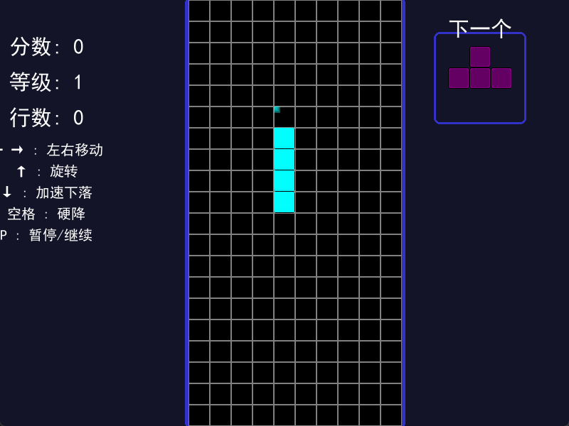

# 🎮 俄罗斯方块游戏

[](https://github.com/txm404/AI-Tetris/releases)
[](https://github.com/txm404/AI-Tetris/actions)
[](LICENSE)



> 现代化增强版俄罗斯方块游戏，融合经典玩法与炫酷视觉效果


## 特性

- 🎨 渐变方块与粒子特效
- ⚡ 实时物理反馈与拖尾效果
- 📊 动态计分与等级系统
- 🚀 自动化多平台构建

## 安装与运行

### 从Release下载

1. 访问项目的[Releases页面](https://github.com/txm404/AI-Tetris/releasess)
2. 下载适合您操作系统的可执行文件：
   - Windows: `tetris.exe`
   - Linux: `tetris.bin`（下载后需要使用`chmod +x tetris.bin`命令赋予执行权限）
3. 直接运行下载的文件即可开始游戏

### 从源代码运行

1. 确保已安装Python 3.x和pip
2. 克隆此仓库：`git clone https://github.com/txm404/AI-Tetris.git`
3. 进入项目目录：`cd AI-Tetris`
4. 安装依赖：`pip install pygame`
5. 运行游戏：`python tetris.py`

## 🎮 游戏控制

| 按键       | 功能描述                 |
|------------|--------------------------|
| ← →        | 左右移动方块             |
| ↑          | 旋转方块                 |
| ↓          | 加速下落                 |
| 空格       | 硬降（立即落到底部）     |
| P          | 暂停/继续游戏            |
| R          | 重新开始游戏             |

## 🛠 构建说明

### 自动构建
GitHub Actions 自动生成以下平台的可执行文件：
- Windows x64
- Linux x86_64

### 手动构建
```bash
# 安装构建依赖
pip install nuitka pygame

# 执行Nuitka编译
python -m nuitka \
  --onefile \
  --follow-imports \
  --plugin-enable=pygame \
  --include-package=pygame \
  --include-data-dir=assets=assets \
  tetris.py
```

## 🤝 贡献指南

欢迎通过以下方式参与贡献：
1. 提交Issue报告问题
2. Fork仓库并提交Pull Request
3. 完善游戏文档
4. 添加新的游戏特效
5. 优化代码结构

## 许可证

[MIT](LICENSE)